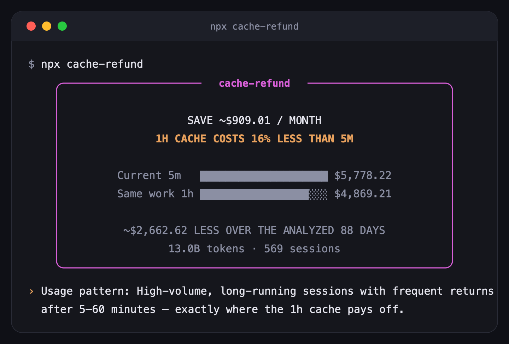
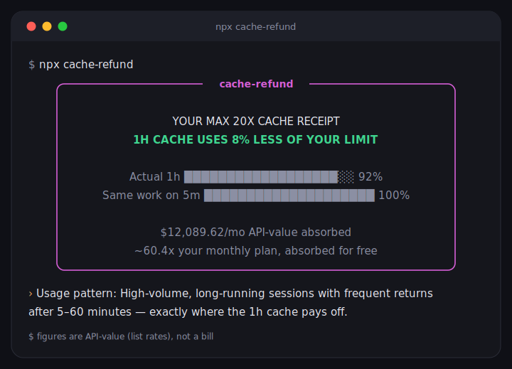

# cache-refund

[](https://github.com/cache-refund/cache-refund/actions/workflows/ci.yml)
[](https://www.npmjs.com/package/cache-refund)


**Finds the money your Claude Code cache is leaking.**



## How to run

```bash
npx cache-refund
```

No install, no account, no config. Node 18+. (The installed command, once you
do install it, is plain `cache-refund`.) Prefer it conversational? It also
ships as a Claude Code plugin — see [Use it inside Claude Code](#use-it-inside-claude-code).

> **100% local.** Reads token counts and timestamps only. No conversation content. No network.

Zero runtime dependencies, too — the entire tool is one `tsc`-compiled TypeScript
CLI, nothing to audit but the code itself.

- **API-billed, still on the 5-minute default?** The recommender leads with the
  projected monthly saving and asks once: "Switch to the 1-hour cache and save
  about $X/month? [Y/n]"
- **API-billed, already on the 1-hour TTL?** The validator: confirms 1h is still
  winning, or tells you to revert if your pattern shifted back toward 5m.
- **On a subscription?** The receipt: how much less of your usage limit the 1h
  cache uses than 5m, plus API-value context and the remaining quota leaks.

Below the break-even on any branch, you get **"Certified optimal"** instead of a
nag — that's also a screenshot worth sharing.

> In March 2026, the Claude API silently downgraded some 1-hour cache writes to
> 5-minute. Settings said 1h; transcripts billed 5m. `cache-refund` reads the TTL
> you *received*, never the one you set.

---

## How it works

Every cache-write is a token you paid a **markup** to store (1.25× base input on
the 5-minute TTL, 2× on the 1-hour TTL). `cache-refund` buckets each write by the
gap since the previous turn in that session. Then it prices a **symmetric
counterfactual** — what a fully-5m world and a fully-1h world would each have
billed on *your* tokens — so the verdict is a threshold you cross, not a guess.

| gap since previous turn | bucket | meaning |
|---|---|---|
| session start, or > 60 min | **cold** | unavoidable — a fresh cache had to be written. Informational. |
| 5–60 min | **recoverable** | the leak. A 1-hour TTL would still have this cached; a 5-minute TTL made you pay to write it again. |
| ≤ 5 min | **warm** | cheap re-use — cached under either TTL. |

The one number that decides the recommendation is **R/C** — the share of your
cache-write tokens that fell in the recoverable bucket. Above **39.5%**, the
1-hour TTL is cheaper for your pattern; below it, the 5-minute default already
wins. Not a vibe — it's `(2 − 1.25) / (2 − 0.1)`, derived in
[METHODOLOGY.md](./METHODOLOGY.md).

Run `npx cache-refund --explain` to see every formula with *your*
numbers substituted in.

## The fix, and how to trust it

For an API user whom the math tells to switch:

```bash
npx cache-refund enable     # adds ENABLE_PROMPT_CACHING_1H=1 to ~/.claude/settings.json
```

Settings changes still require confirmation (unless you pass `--yes`), back up
`settings.json`, and preserve every other key. The analyzer also saves one
content-free Markdown report per successful run under
`~/.claude/cache-refund/reports/`; reports contain aggregate counts, timestamps,
TTL evidence, calculations, and leak rows — never prompts or conversation text.
`npx cache-refund revert` undoes the settings change.

The env flag only applies to **sessions started after the change**, and Claude
Code has had intermittent flakiness landing it
([anthropics/claude-code#49139](https://github.com/anthropics/claude-code/issues/49139)),
so the tool verifies itself rather than asking you to trust it:

```bash
npx cache-refund verify     # after a few turns in a fresh session
```

`verify` re-reads your *newest* transcripts and checks the **TTL reality check**
— the TTL you are *actually receiving* per your last few days of usage, read
straight from the `ephemeral_5m`/`ephemeral_1h` usage fields, not from what
`settings.json` claims. If 1h landed, it says so. Later:

```bash
npx cache-refund recheck    # the comeback loop
```

`recheck` compares against a small baseline saved at enable time and shows
"since switching: $X saved". No external tools at any step — the product
verifies the product.

## Why the TTL reality check exists (a cautionary tale)

In March 2026 the Claude API server-side **silently downgraded** some 1-hour
cache writes to 5-minute for a stretch — settings said 1h, transcripts billed
5m. Anyone reasoning from their *config* rather than their *transcripts* was
quietly wrong for weeks.

The sharpest illustration we know of: a public community backtest once modeled
cache-keepalive strategies against an *assumed* TTL. When the models were
finally checked against real billed tokens, **six carefully-modeled strategies
all lost to a one-line heuristic** — and part of the modeling had rested on a
TTL that the server wasn't actually honoring. The lesson `cache-refund`
takes from that story: **measure the TTL you received, don't trust the one you set.**
That is why every checkup leads with the reality-check line, and why the
regression *watchdog* (below) is the roadmap's flagship.

## Use it inside Claude Code

`cache-refund` also ships as a Claude Code plugin, so you can run the checkup
conversationally instead of from a terminal:

```
/plugin marketplace add cache-refund/cache-refund
```

Then just ask — "am I leaking money on cache?" or "run cache-refund" — and the
agent runs the analyzer, narrates the number, the gap breakdown, and the
verdict in plain language. It never edits `settings.json` on your behalf: it
only ever surfaces the `enable`/`revert` command and asks you to run it — the
settings changes still go through the tool's own confirmation prompt, same as the CLI.

## Share your card

```bash
npx cache-refund card
```

Post it with #cacherefund, or drop it in [the pinned Discussion](https://github.com/cache-refund/cache-refund/discussions/4).

## Other output modes

```bash
npx cache-refund share      # deal your card + the share prompt, any time
npx cache-refund card       # terminal receipt: outcome box, usage story, and share hint
npx cache-refund --md       # paste-ready markdown block for Slack / Teams
npx cache-refund --compact  # short outcome summary for logs and narrow terminals
npx cache-refund --json     # full machine-readable summary (stable schema, never prompts)
npx cache-refund --explain  # every formula, your numbers substituted (METHODOLOGY, one flag away)
```

Flags: `--days N` (default 90) · `--project <path>` (default: all projects) ·
`--price <model=$/MTok,...>` (override pricing) · `--yes` / `-y` (skip confirm) ·
`--no-color` · `--all-time` · `--no-share` (silence card generation and the final action menu; same as
env `CACHE_REFUND_NO_SHARE=1`) · `--plan <usd>` (monthly subscription price;
subscription branch only — overrides an automatically recognized plan price).
Exit codes: `0` ok · `1` no transcripts found · `2` parse/usage/internal error.

## FAQ

**I'm on a subscription (Pro/Max) — is there anything to do?**
No action, but there is a receipt. Subscribers already get the 1-hour TTL
automatically; `cache-refund` shows you what it saved you and where your quota is
still leaking (model switches, cold starts). Dollar figures are labeled
`$-equivalent (API list rates)` because the subscription quota formula is
undisclosed — we price your tokens at API list rates so the number is *anchored
and reproducible*, but it is not a bill. When Claude Code's local account cache
contains a recognized Max tier, `cache-refund` reads only the billing/tier fields
(never name, email, or account IDs) and shows the known plan framing. Unknown or
stale tiers stay price-free. `--plan <usd>` remains a manual override.



**Does it work on Bedrock / Vertex?**
Yes. `ENABLE_PROMPT_CACHING_1H` is an API/Bedrock/Vertex/Foundry feature, so the
enable recommendation applies to all of them. The analyzer reads the same
transcript format regardless of provider.

**Does it work with Codex / OpenAI?**
There's nothing for `cache-refund` to advise there. OpenAI's prompt caching is
automatic — writes cost nothing extra, cached reads are discounted, and
retention tiers are priced identically — so there's no 5m-vs-1h decision to
make. A cache-health view for other CLIs is on the roadmap.

**Is the efficiency score comparable between people?**
Only within a `score_version`. This is `score_version: 1` (printed in `--json`
and in [METHODOLOGY.md](./METHODOLOGY.md)). The formula is fully documented; if
it ever changes, the version bumps, so a v1 score is only ever compared to
another v1 score.

**A leak row says $0.00 — is that a bug?**
Almost certainly not. Subagent-5m overhead is $0 if you ran no sidechains in the
window; compaction rewrites are near-$0 if you rarely `/compact`; and the
recoverable-leak dollars are *net* of what a 1h TTL would itself cost, so a row
can legitimately be $0 when the tail write cancels the saving. Zero rows are
honest, not missing data.

**Does sharing phone home?**
No. The CLI itself makes zero network requests, sharing included. At the end of
an interactive run it generates the terminal-style card locally and shows one
single-key menu: Enter copies the image, `r` copies the detailed report, platform
keys open your own browser, and `q`/Escape exits. X and Bluesky receive prefilled
text through their compose URLs. LinkedIn opens its composer, copies the prepared
post text to your clipboard, and reveals the card image with its exact path for
attachment. Nothing is transmitted by `cache-refund`, ever. `--no-share` (or
`CACHE_REFUND_NO_SHARE=1`) suppresses the image/menu while the aggregate report
is still saved.

**I think a number is wrong.**
That is the highest-priority kind of bug report. Open a
[wrong-number issue](https://github.com/cache-refund/cache-refund/issues/new?template=wrong-number.yml)
— it asks for your `--json` and `--explain` output (token counts and timestamps
only, no content) so the exact figure can be reproduced and traced through the
formula.

## Roadmap

- **v1.1 — the TTL regression watchdog.** A `watch` mode that alarms the moment
  your received TTL flips (the March-2026 incident, turned into a live tripwire).
  Plus sleep-window learning to split cold gaps into "asleep" vs "abandoned".
  `watch` is teased in the checkup footer as *coming* — it is not a shipped
  command yet.
- **v1.5 — `team`** aggregate mode (v1 already ships `--json` + a documented `jq`
  merge for fleets).
- **v2 — a policy simulator** behind the same cost model: price
  `5m+keepalive` and `1h+keepalive` for API users.

The roadmap has one rule (see [METHODOLOGY.md](./METHODOLOGY.md) and
[GOOD-SETTINGS.md](./GOOD-SETTINGS.md)): every new check must be *computed from
your transcripts, priced, and paired with one concrete fix.* Generic
settings-opinion tips are never product.

## Relationship to spend dashboards

Spend dashboards report what you **spent**. `cache-refund` reports what you
**wasted, why, and the fix** — it is the decision, not the dashboard. They
compose: watch your spend wherever you already watch it, then run `cache-refund`
when you want to know whether the cache defaults are costing you and what to
change. (The per-TTL write pricing here comes from Anthropic's published
per-model rates, re-derived in [METHODOLOGY.md](./METHODOLOGY.md) with the
retrieval date cited in `src/pricing.ts`.)

## Contributing & license

Wrong-number reports get a priority lane — see
[CONTRIBUTING.md](./CONTRIBUTING.md). MIT licensed, © 2026 Ilan Bar-Magen.

Methodology in full: [METHODOLOGY.md](./METHODOLOGY.md) · or run `npx cache-refund --explain`.
